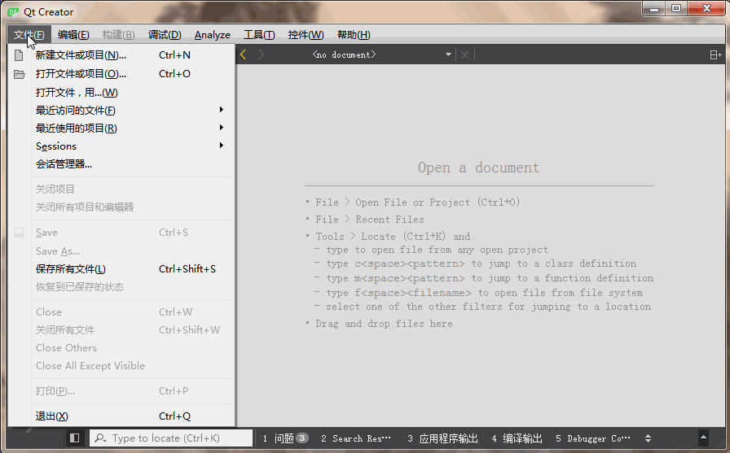

# 编写第一个c语言代码

## 本节知识点

* 创建一个c语言项目

* 剖析第一个c语言程序

## 创建第一个c语言项目

* 动图演示

    


## 剖析第一个c语言程序


### 下面是一个c语言必须的基础代码。以下代码什么也没做，不具备任何功能。
    ```
    int main(int argc, char *argv[])
    {
        return 0;
    }
    ```

### 这是第一个程序

    ```
    #include <stdio.h>
    
    int main(int argc, char *argv[])
    {
        printf("Hello World!\n");
        return 0;
    }
    ```
### 代码讲解

`#include <stdio.h>` 包含头文件stdio.h，后面代码中要用的printf函数就在stdio.h文件中定义了。所以在使用printf之前要包含这个头文件。

`int main(int argc, char *argv[])` 主函数，是程序的入口，程序从这里开始执行，暂时我们只要知道这是固定写法。

`{` 左花括号和右花括号中所包含的代码，都属于主函数。

`printf("Hello World!\n");` 这句代码的功能就是显示一句话 Hello World!。 `\n` 这个的作用是表示输出一个换行。 整句话的作用就是输出Hello World!之后换行。

`return 0;` return是返回的意思，表示返回一个值，这里表示主函数执行完之后返回0，主函数返回，那么程序就结束了。

`}` 右花括号与前面的左花括号成对，表示主函数结束了


## 课后练习

修改第一个程序代码，让程序输出以下文字：

```
不学网
noxue.com
```


## 链接

- [目录](summary.md)
- 上一节：[c语言开发环境搭建](02.1.md)
- 下一节：[常量的定义与使用](03.1.md)